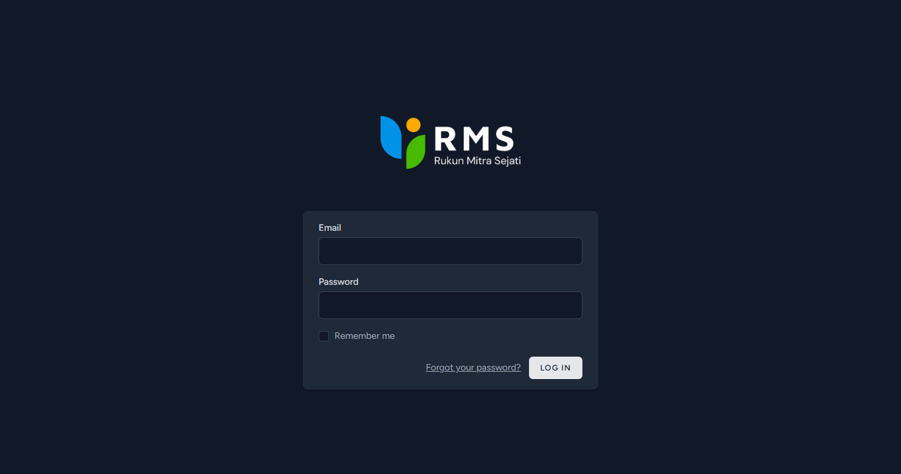

# Laravel CCTV

Webiste untuk Sheet Data CCTV

## Instalasi

### Untuk menjalankan aplikasi ini, anda memerlukan:

- PHP versi 8.2 atau lebih tinggi (Linux menggunakan `Apache2`)
- Composer Versi 2.7.8
- MySQL
- Node.js v20.11.1
- NPM 10.2.4

### Extensi PHP yang perlu di aktifkan di php.ini, anda memerlukan:

- GD
- CURL
- Zip
- mbstring
- php_imagick.dll

### Langkah-langkah instalasi adalah sebagai berikut:

#### Setting Database di phpmyadmin dan Installasi Laravel

1. Buat database baru dengan nama `rms_cctv`
2. Clone repositori ini ke direktori lokal anda dengan perintah `git clone https://github.com/username/laravel-library-app.git`
3. Masuk ke direktori aplikasi dengan perintah `cd laravel-library-app`
4. Jalankan perintah `composer install` untuk menginstal dependensi PHP
5. Jalankan perintah `cp .env.example .env` untuk membuat file konfigurasi
6. Edit file .env sesuai dengan konfigurasi database `rms_cctv` anda dan sesuaikan URL_IP sesuai IP local
7. Jalankan perintah `php artisan key:generate` untuk membuat kunci aplikasi
8. Jalankan perintah `php artisan migrate --seed` untuk membuat tabel database dan mengisi data awal
9. Jalankan perintah `npm install` untuk menginstal dependensi JavaScript
10. Jalankan perintah `npm run dev` untuk mengkompilasi aset
11. Jalankan perintah `php artisan serve` untuk menjalankan server lokal
12. Bisa juga menggunakan `Php artisan serve --host "IP LOCAL ANDA" --port "CUSTOM PORT"` contoh `php artisan serve --host 192.168.22.90 --port 8089`

## Note For Error

Jika pada saat seed database error. silahkan import database melalui file .sql yang ada di direktori project. 

## Penggunaan

Setelah menjalankan server lokal, anda dapat mengakses aplikasi di http://localhost:8000
Untuk sementara ini fitur user saja yang masih tersedia.
Contohnya anda dapat login sebagai user dengan menggunakan email dan password berikut:

- User: grovertheo@gmail.com / rmsit234

### Sebagai user, anda dapat melakukan hal-hal berikut:

- Melihat daftar CCTV di all branch
- Menambahkan Data baru untuk branch Baru
- Mengedit isi Data
- Delete Data 
- Open Encrypted Data dengan Password `rmsit234`

## Lisensi
Aplikasi ini dilisensikan di bawah NdoghIT.
